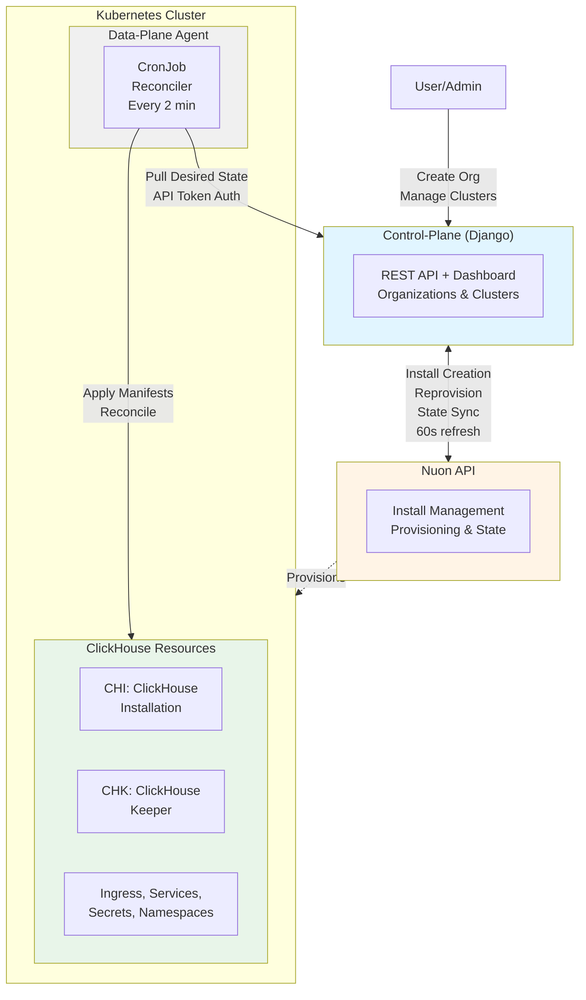

# ACME ClickHouse Platform - Architecture Diagrams

This document provides comprehensive architecture diagrams for the acme-sh platform, showing how the Control-Plane, Data-Plane, and Nuon API interact to provision and manage ClickHouse clusters.

## High-Level Overview

This diagram shows the primary components and their communication patterns:



### Key Relationships

- **1 Organization = 1 Nuon Install = 1 Kubernetes Cluster**
- **Control-Plane ↔ Nuon API**: Bidirectional communication (creates installs, fetches state)
- **Data-Plane → Control-Plane**: Unidirectional pull (every 2 minutes via REST API)
- **Data-Plane → Kubernetes**: Applies manifests to create/update/delete ClickHouse resources

---

## Detailed Architecture

This diagram shows the internal components, services, and data flows:

```mermaid
flowchart TB
    User[User/Admin]

    subgraph ControlPlane["Control-Plane (Django App)"]
        direction TB

        subgraph WebLayer["Web Layer"]
            Dashboard[Dashboard Views<br/>HTML + HTMX]
            API[REST API<br/>DRF ViewSets]
        end

        subgraph Apps["Django Apps"]
            OrgApp[Organizations App<br/>- Organization Model<br/>- NuonInstallMixin<br/>- Workflows]
            ClusterApp[Clusters App<br/>- Cluster Model<br/>- CRUD Operations]
            AuthApp[Authorization App<br/>- User & Service Accounts<br/>- API Tokens]
        end

        subgraph Tasks["Celery Tasks"]
            RefreshTask[refresh_all_orgs<br/>Every 60s]
            CreateInstall[create_nuon_install]
            Reprovision[reprovision_nuon_install]
        end

        subgraph Integration["Nuon Integration"]
            NuonClient[NuonAPIClient<br/>nuon-python SDK]
        end

        DB[(PostgreSQL<br/>Org, Cluster,<br/>User Data)]
    end

    subgraph NuonAPI["Nuon API (api.nuon.co)"]
        direction TB
        InstallMgmt[Install Management]
        WorkflowMgmt[Workflow Engine<br/>Provision/Reprovision]
        StateMgmt[State Management<br/>Install State & Stack]
    end

    subgraph K8sCluster["Kubernetes Cluster (Customer AWS)"]
        direction TB

        subgraph DataPlaneAgent["Data-Plane Agent (CronJob)"]
            direction LR
            CronJob[CronJob: */2 * * * *<br/>Forbid Concurrency]

            subgraph Services["Services"]
                Reconciler[Reconciler Service<br/>- reconcile_all_clusters<br/>- CREATE/UPDATE/DELETE]
                TemplateService[Template Service<br/>- Jinja2 Rendering<br/>- Cluster Type Logic]
                K8sService[K8s Service<br/>- Apply Manifests<br/>- Namespace CRUD]
                APIService[API Service<br/>- HTTP Client<br/>- Token Auth]
            end

            CronJob --> Reconciler
            Reconciler --> APIService
            Reconciler --> TemplateService
            Reconciler --> K8sService
        end

        subgraph K8sResources["Kubernetes Resources (Per Cluster)"]
            NS[Namespace<br/>cluster-name]
            Secret[Secret<br/>CH Credentials]
            Svc[Service<br/>ClusterIP 8123/9000]
            Ingress[Ingress<br/>Public/Tailnet]
            CHIRes[CHI Resource<br/>ClickHouseInstallation]
            CHKRes[CHK Resource<br/>ClickHouseKeeper]
        end

        subgraph Operator["ClickHouse Operator (Altinity)"]
            CHOp[Watches CHI/CHK<br/>Creates Pods & StatefulSets]
        end

        K8sService -->|kubectl apply| NS
        K8sService -->|kubectl apply| Secret
        K8sService -->|kubectl apply| Svc
        K8sService -->|kubectl apply| Ingress
        K8sService -->|kubectl apply| CHIRes
        K8sService -->|kubectl apply| CHKRes

        CHOp -.->|Watches| CHIRes
        CHOp -.->|Watches| CHKRes
        CHOp -->|Creates| Pods[ClickHouse Pods<br/>StatefulSets, PVCs]
    end

    User -->|Web UI| Dashboard
    User -->|API Calls| API

    Dashboard --> Apps
    API --> Apps

    Apps --> DB
    Apps --> Tasks
    Tasks --> NuonClient
    NuonClient <-->|HTTPS| NuonAPI

    RefreshTask -->|Every 60s| NuonClient

    APIService -->|GET /api/orgs/{id}<br/>GET /api/orgs/{id}/install-state<br/>GET /api/orgs/{id}/clusters<br/>Every 2 min| API

    NuonAPI -.->|Provisions K8s<br/>Deploys Agent| K8sCluster

    CreateInstall -->|When Org Created| NuonClient
    Reprovision -->|Manual Trigger| NuonClient

    style ControlPlane fill:#e1f5ff
    style NuonAPI fill:#fff4e6
    style DataPlaneAgent fill:#f0f0f0
    style K8sResources fill:#e8f5e9
    style Operator fill:#ffe6f0
```

---

## Component Details

### Control-Plane (Django)

**Purpose**: Orchestration layer, user interface, and source of truth for desired state

**Key Components**:
- **Organizations App**: Manages organizations, Nuon installs, and workflows
- **Clusters App**: CRUD operations for ClickHouse clusters
- **Dashboard**: HTMX-based reactive UI
- **NuonAPIClient**: Wrapper for Nuon API using `nuon-python` SDK

**API Endpoints**:
- `GET /api/orgs` - List organizations
- `GET /api/orgs/{id}` - Get organization details
- `GET /api/orgs/{id}/install-state` - Get Nuon install state (infrastructure config)
- `GET /api/orgs/{id}/clusters` - List clusters for organization
- `POST /api/orgs/{id}/trigger_action` - Trigger async actions (refresh, reprovision)
- `POST /api/orgs/{id}/approve-step` - Approve workflow step
- `POST /api/orgs/{id}/clusters` - Create new cluster

**Celery Tasks**:
- `refresh_all_orgs`: Runs every 60 seconds to sync Nuon state
- `create_nuon_install`: Creates Nuon install when organization is created
- `reprovision_nuon_install`: Triggers reprovisioning workflow

**Data Model**:
```python
Organization:
    - name, slug, region
    - nuon_install_id (UUID)
    - nuon_install (JSONField)
    - nuon_install_state (JSONField)
    - nuon_install_stack (JSONField)
    - nuon_workflows (JSONField)

Cluster:
    - name, slug
    - organization (FK)
    - cluster_type (single_node, cluster, keeper)
    - ingress_type (none, public, tailnet)
    - status (JSONField)
```

### Nuon API

**Purpose**: Infrastructure provisioning and lifecycle management

**Responsibilities**:
- Provisions Kubernetes clusters in customer AWS accounts
- Manages Terraform/OpenTofu stacks
- Deploys the data-plane agent as a CronJob
- Tracks install state, workflows, and components
- Provides infrastructure outputs (domain, certificates, images, Karpenter config)

**Key Concepts**:
- **Install**: Represents a single deployment of the platform
- **Workflow**: Provision or reprovision operations with approval steps
- **Components**: Docker images, certificates, infrastructure outputs
- **Install State**: Current configuration including Karpenter node pools, DNS domains, component versions

### Data-Plane Agent

**Purpose**: Reconciliation agent that enforces desired state on Kubernetes

**Deployment**:
- Runs as a Kubernetes CronJob (every 2 minutes)
- Concurrency policy: Forbid (prevents overlapping runs)
- Resource limits: 256Mi memory, 200m CPU

**Reconciliation Loop**:
1. Fetch organization data from control-plane API
2. Fetch install state (Karpenter config, domain, images, certificates)
3. Fetch list of clusters with desired state
4. For each cluster:
   - Check if namespace exists (actual state)
   - Determine action: CREATE, UPDATE, DELETE, NOOP
   - Generate credentials (first time only)
   - Render Jinja2 templates for K8s manifests
   - Apply manifests via kubectl

**Services**:
- **Reconciler**: Orchestrates reconciliation workflow
- **Template Service**: Renders Jinja2 templates based on cluster type
- **K8s Service**: Wraps Kubernetes Python client for CRUD operations
- **API Service**: HTTP client for control-plane REST API

**Kubernetes Resources Created**:

*All Cluster Types*:
- Namespace with label `managed_by: acme-ch-data-plane-agent`
- Service (ClusterIP) exposing ports 8123 (HTTP), 9000 (native)
- Ingress (conditional):
  - Public: AWS ALB with external-dns annotation
  - Tailnet: Tailscale ingress for private access

*Single Node*:
- Secret with ClickHouse password
- CHI (ClickHouseInstallation) for single-node deployment

*Keeper*:
- CHK (ClickHouseKeeperInstallation) with 3 replicas

*Cluster*:
- Secret with ClickHouse password
- CHK (3-node keeper cluster) for coordination
- CHI (multi-node ClickHouse with 2 replicas, 1 shard)

---

## Data Flow

### 1. Organization Creation Flow

```
User → Control-Plane (Create Org)
  ↓
Control-Plane → Create Org in DB
  ↓
Signal triggers create_nuon_install task
  ↓
Control-Plane → Nuon API: Create Install
  ↓
Nuon API: Provision K8s cluster, deploy data-plane agent
  ↓
Control-Plane: Polls install state every 60s
  ↓
Data-Plane Agent: Starts running every 2 min
```

### 2. Cluster Creation Flow

```
User → Control-Plane (Create Cluster)
  ↓
Control-Plane → Save Cluster to DB (desired state)
  ↓
Data-Plane Agent (next run, within 2 min):
  ↓
Data-Plane → Control-Plane API: GET /api/orgs/{id}/clusters
  ↓
Data-Plane: Detects new cluster (CREATE action)
  ↓
Data-Plane: Generate credentials
  ↓
Data-Plane: Render templates (namespace, secret, service, ingress, CHI/CHK)
  ↓
Data-Plane → Kubernetes: kubectl apply manifests
  ↓
ClickHouse Operator: Detects CHI/CHK resources
  ↓
ClickHouse Operator: Creates Pods, StatefulSets, PVCs
  ↓
Result: ClickHouse cluster running
```

### 3. State Synchronization

**Control-Plane → Nuon (every 60s)**:
```
refresh_all_orgs task
  ↓
For each organization:
  - GET install state
  - GET workflows
  - GET install stack
  - Update Organization model JSONFields
```

**Data-Plane → Control-Plane (every 2 min)**:
```
CronJob triggers reconcile command
  ↓
GET /api/orgs/{id}
GET /api/orgs/{id}/install-state
GET /api/orgs/{id}/clusters
  ↓
Compare desired state vs actual state
  ↓
Apply changes to Kubernetes
```

---

## Security & Authentication

### Control-Plane → Nuon API
- Token-based authentication (`NUON_API_TOKEN`)
- Custom header: `X-Nuon-Org-ID`

### Data-Plane → Control-Plane
- Service account created per organization: `{org.identifier}-sa@acme-ch.com`
- DRF Token authentication
- Token passed in `Authorization: Token {token}` header

### Data-Plane → Kubernetes
- In-cluster service account with RBAC permissions
- Permissions needed:
  - Namespaces: CRUD
  - Secrets: CRUD
  - Services: CRUD
  - Ingresses: CRUD
  - CHI/CHK custom resources: CRUD

---

## Timing & Scheduling

| Component | Frequency | Purpose |
|-----------|-----------|---------|
| Control-Plane refresh | Every 60s | Sync Nuon install state, workflows, stack |
| Data-Plane reconcile | Every 2 min | Sync clusters from control-plane to K8s |
| Nuon workflow polling | On-demand | User-triggered refresh or approval |

---

## Technology Stack

### Control-Plane
- **Framework**: Django 5.2.8 + DRF
- **Language**: Python 3.13
- **Database**: PostgreSQL (SQLite for dev)
- **Cache**: Redis
- **Task Queue**: Celery + Redis broker
- **UI**: HTMX + Tailwind CSS
- **SDK**: nuon-python (Nuon API client)

### Data-Plane
- **Language**: Python 3.13
- **Package Manager**: uv
- **CLI**: Fire (CLI framework)
- **HTTP Client**: httpx
- **Templating**: Jinja2
- **K8s Client**: kubernetes-python

### Infrastructure
- **Orchestration**: Kubernetes
- **Database**: ClickHouse
- **Operator**: Altinity ClickHouse Operator
- **Coordination**: ClickHouse Keeper
- **Ingress**: AWS ALB Controller / Tailscale
- **Node Provisioning**: Karpenter
- **Storage**: AWS EBS (ebi storage class)
