{{ $region := .nuon.cloud_account.aws.region }}

  
  <h1>
    ClickHouse Data Plane
  </h1>
  <small>
{{ if .nuon.install_stack.outputs }}
AWS | {{ dig "account_id" "000000000000" .nuon.install_stack.outputs }} | {{ dig "region" "xx-vvvv-00" .nuon.install_stack.outputs }} | {{ dig "vpc_id" "vpc-000000" .nuon.install_stack.outputs }}
{{ else }}
AWS | 000000000000 | xx-vvvv-00 | vpc-000000
{{ end }}
  </small>

The data-plane for a BYOC A.C.M.E. ClickHouse install.

## Components

```mermaid
graph TD
  img_clickhouse_keeper["img_clickhouse_keeper<br/>0-image-clickhouse_keeper.toml"]
  crd_clickhouse_operator["crd_clickhouse_operator<br/>2-crd-clickhouse_operator.toml"]
  img_clickhouse_server["img_clickhouse_server<br/>0-image-clickhouse_server.toml"]
  data_plane_agent_rbac["data_plane_agent_rbac<br/>3-data-plane-agent-rbac.toml"]
  img_ch_ui["img_ch_ui<br/>0-image-ch-ui.toml"]
  data_plane_agent["data_plane_agent<br/>3-data-plane-agent.toml"]
  crd_tailscale_operator["crd_tailscale_operator<br/>2-crd-tailscale_operator.toml"]
  storage_class["storage_class<br/>1-storage_class.toml"]
  img_altinity_clickhouse_operator["img_altinity_clickhouse_operator<br/>0-image-altinity-clickhouse_operator.toml"]
  certificate["certificate<br/>1-certificate.toml"]
  tailscale_proxy["tailscale_proxy<br/>2-km-tailscale_proxy.toml"]
  img_acme_ch_data_plane_agent["img_acme_ch_data_plane_agent<br/>0-image-data_plane_agent.toml"]
  img_tailscale_operator["img_tailscale_operator<br/>0-image-tailscale_operator.toml"]
  img_clickhouse_metrics_exporter["img_clickhouse_metrics_exporter<br/>0-image-altinity-clickhouse_metrics_exporter.toml"]


  class crd_clickhouse_operator,data_plane_agent_rbac,data_plane_agent,crd_tailscale_operator,storage_class,certificate,tailscale_proxy tfClass;
  class img_clickhouse_keeper,img_clickhouse_server,img_ch_ui,img_altinity_clickhouse_operator,img_acme_ch_data_plane_agent,img_tailscale_operator,img_clickhouse_metrics_exporter imgClass;

  classDef tfClass fill:#D6B0FC,stroke:#8040BF,color:#000;
  classDef imgClass fill:#FCA04A,stroke:#CC803A,color:#000;
```

## Inputs

| Name                | Display Name           | Description                                                           | Group         | Type   | Default                         |
| ------------------- | ---------------------- | --------------------------------------------------------------------- | ------------- | ------ | ------------------------------- |
| `cluster_id`        | Cluster ID             | The id for the acme-ch org. Used to tag resources in the EKS Cluster. | config        | string | _none_                          |
| `cluster_name`      | Cluster Name           | The name for the EKS cluster.                                         | config        | string | _none_                          |
| `deploy_headlamp`   | Deploy Headlamp        | Toggle to enable the headlamp eks admin interface.                    | config        | bool   | _none_                          |
| `deploy_tailscale`  | Deploy Tailscale       | Toggle to enable tailscale for this cluster.                          | config        | bool   | _none_                          |
| `acme_ch_api_token` | API Token              | API Token for the service account user for the org.                   | control_plane | string | _none_                          |
| `acme_ch_api_url`   | Control Plan API URL   | The root url for the control plane service.                           | control_plane | string | `https://acme-ch.demo.nuon.fun` |
| `acme_ch_org_id`    | Organization Id        | Org ID of the org we are creating the cluster for.                    | control_plane | string | _none_                          |
| `enable_delegation` | Enable Role Delegation | Toggle on to enable role delegation.                                  | control_plane | bool   | `false`                         |

## Secrets

| Name                            | Display Name                  | Description                                                     | K8s Sync | K8s Namespace | K8s Secret                      |
| ------------------------------- | ----------------------------- | --------------------------------------------------------------- | -------- | ------------- | ------------------------------- |
| `clickhouse_cluster_pw`         | Clickhouse Cluster Password   | Password for the Clickhouse Cluster for the default admin user. | True     | `clickhouse`  | `clickhouse-cluster-pw`         |
| `clickhouse_operator_pw`        | Clickhouse Operator Password  | Password for the Clickhouse Operator Deployment                 | True     | `clickhouse`  | `clickhouse-operator-pw`        |
| `tailscale_oauth_client_id`     | Tailscale Oauth Client ID     | Client ID for the Oauth Trust Credentials for this cluster.     | True     | `tailscale`   | `tailscale-oauth-client-id`     |
| `tailscale_oauth_client_secret` | Tailscale Oauth Client Secret | Client Secret for the Oauth Trust Credentials for this cluster. | True     | `tailscale`   | `tailscale-oauth-client-secret` |
